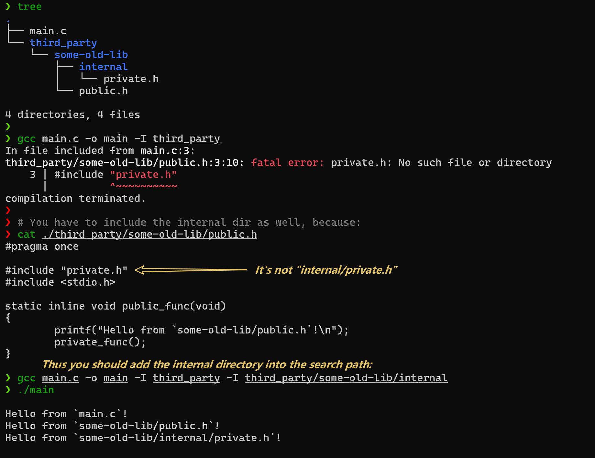

# inclean

_English | [简体中文](docs/README.zh-CN.md)_

A C/C++ `#include` path normalizer.

Many legacy C/C++ libraries `#include` headers by bare filename
(`#include "bar.h"`) even though the actual header lives several
directories deep (`src/internal/bar.h`). To consume such a library a
caller must add every internal directory to their `-I` list — which
pollutes their include namespace and breaks the library's
encapsulation.

`inclean` does a one-shot, source-level normalization. It scans every
source file in the library and rewrites each `#include` so it resolves
cleanly against a small, explicit set of allowed include directories.
After running `inclean`, consumers only `-I` the allowed directories.

## Why inclean?

When using legacy libraries like `some-old-lib`, consumers often have to leak the library's internal directory structure into their own build configuration.

**Without inclean:**
You have to add internal library paths to your own `-I` search paths to compile successfully.

```sh
gcc main.c -o main -I third_party -I third_party/some-old-lib/internal
```



**Using inclean:**
`inclean` automatically cleans up and standardizes the `#include` paths inside `some-old-lib`. Consumers only need to include the top-level directory.

```sh
gcc main.c -o main -I third_party
```


---

## Install

`inclean` is published to **crates.io**, **PyPI**, and as prebuilt
binaries on **GitHub Releases**. Pick whichever ecosystem you already
have on your machine.

### Via PyPI (Python wheels — no Rust toolchain needed)

Three options:

```sh
uv tool install inclean      # isolated, fastest
pipx install inclean         # isolated
pip install inclean          # into the current environment
```

The wheels ship the native binary built by maturin; `inclean` lands on
your `PATH` the same way `ruff` or `uv` do. Requires Python ≥ 3.8.

### Via cargo

Two options:

```sh
cargo binstall inclean       # prebuilt binary from GitHub Releases (no compilation)
cargo install inclean        # build from crates.io
```

`cargo binstall` fetches inclean's binstall metadata from crates.io and downloads the
matching prebuilt archive from this repo's GitHub Releases (no
compilation).
`cargo binstall` is a third-party cargo subcommand — install it first
via [cargo-bins/cargo-binstall](https://github.com/cargo-bins/cargo-binstall)
if you don't already have it.

`cargo install` downloads the source from crates.io and compiles it locally.

### Prebuilt binaries (no package manager)

Download a tarball for your platform from the
[latest GitHub Release](https://github.com/inaku-Gyan/inclean/releases/latest)
and put `inclean` (or `inclean.exe`) on your `PATH`.

### From repo source

Clone this repo and build from source:

```sh
git clone https://github.com/inaku-Gyan/inclean.git
cd inclean
cargo install --path .
```

## Quick start

`inclean` is driven by an `inclean.toml` placed at the root of the
library you want to clean up. A typical workflow:

```sh
inclean init                # write a documented starter inclean.toml
$EDITOR inclean.toml        # tell it where your headers live
inclean check               # dry-run: report every proposed change
inclean diff                # see the rewrites as a unified diff
inclean apply               # write the rewrites in place
```

`check` / `diff` / `apply` optionally take `[PATHS...]` to restrict
which files are processed; with no paths they consider every source
file under the project root. `-c PATH` overrides the upward `inclean.toml`
walk; `-j N` sets the worker thread count.

### Configuration at a glance

Each `[[rule]]` narrows down the includes it owns, then chooses what to do
with them.

- `file_paths` and `file_suffixes` select source files.
- `include_forms` and `include_match` select include lines.
- `include_directories` enables header lookup; `include_resolved_match`
  filters the resolved header path.
- `action` rewrites, removes, comments out, keeps, or reports an error;
  `trailing_comment` handles same-line comments.

Most projects only need `include_match` plus one `action`. Use
`include_directories` for path normalization, and look at `macro_rewrite` only
when you need to edit macro-based includes. For glob rules, macro include
behavior, conflict handling, copy semantics, and all fields, see the
[configuration reference](docs/configuration.md).

### Example

A simple `replace`-action config that rewrites `#include "foo.h"` to
`#include "lib/foo.h"`:

```toml
[project]
root = "."
version = "0.3.0"
min_inclean_version = "0.3.0"

[[rule]]
name = "lib-prefix"
file_paths = ["src/**/*"]
include_match = ["foo.h", "bar.h"]
action = { type = "replace", with = "lib/${original}" }
```

See [tests/golden_tests/](tests/golden_tests/) for runnable end-to-end examples.

## Editor support

`inclean.toml` ships with a JSON Schema for editor completion and
validation. Editors that understand the `#:schema` directive (VS Code
with [Tombi](https://tombi-toml.github.io/tombi/)
or [Even Better TOML](https://marketplace.visualstudio.com/items?itemName=tamasfe.even-better-toml),
Helix, Zed) automatically pick it up:

```toml
#:schema https://raw.githubusercontent.com/inaku-Gyan/inclean/v0.4.0/schemas/inclean.toml.schema.json

[project]
root = "."
version = "0.4.0"
min_inclean_version = "0.4.0-alpha.3"
```

(The above version numbers are examples for this release line.)

`inclean init` writes both the `#:schema` line (for the editor) and the
`[project].version` + `[project].min_inclean_version` fields. `version`
tracks the CLI that generated the file; `min_inclean_version` tracks the
oldest CLI expected to parse that generated config. To upgrade schema
validation, edit the version segment in the URL to a newer release tag.

**`#:schema` and the `[project]` version fields are independent.** The
`#:schema` URL is purely for editor tooling; the CLI runs its own
two-direction compatibility check (`CLI_COMPAT_MIN <= cfg.version` AND
`cfg.min_inclean_version <= CLI_CURRENT`). inclean is pre-1.0 and does
not ship migration shims for breaking schema changes — see
[CLAUDE.md](CLAUDE.md#pre-10-backward-compat-policy).

You can also dump a local copy:

```sh
inclean config schema --output inclean.toml.schema.json
```

## Documentation

- **[Configuration reference](docs/configuration.md)** — field meanings,
  matching syntax, actions, copy semantics, constants, and examples.
- **[schemas/inclean.toml.schema.json](schemas/inclean.toml.schema.json)** —
  editor schema generated from the Rust config structs.
- **[tests/golden_tests/](tests/golden_tests/)** — runnable examples for
  replacement, resolution, copy semantics, suppression, trailing comments,
  conflicts, and encoding preservation.
- **[CONTRIBUTING.md](CONTRIBUTING.md)** — toolchain, dev workflow,
  conventions, scope.

## License

[BSD 3-Clause](LICENSE).
